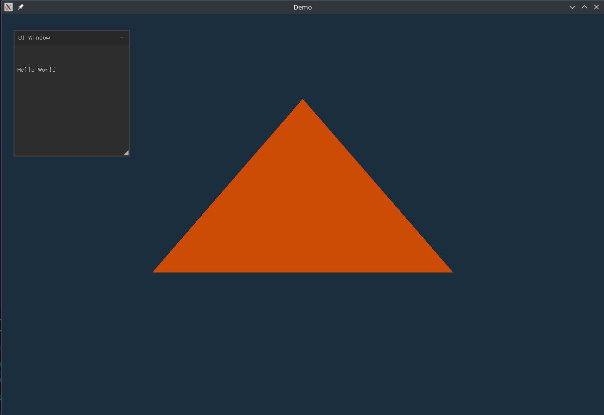

# GLFW Learn Project #

Project created to test and learn about comp. graphics.
I intend to learn about C lang, Cmake, GLFW, OpenGL and Vulkan.
Maybe some day I can apply this new knoladge to dev some games/game engine.
Another thing that I wanna to try is implement a gcode visualizer tool and cost/budget calculator
for 3d printing stuff.
Actualy my curiosity over GLFW came from the Slic3r and OrcaSlicer softwares (open source slicer). If I successfully learn about this things I can try to load my own budget tool inside the OrcaSlicer.

**Build:** ```$ cmake --build build/ --config Debug --target all ```

## Update 1: Hello World Triangle with UI (nuklear)

Hello World! Nice!



*Thanks to [Victor Gordan](https://www.youtube.com/watch?v=hYZNN0MTLuc&list=PLPaoO-vpZnumdcb4tZc4x5Q-v7CkrQ6M-&index=3)*

**Next step:** Organize the code!